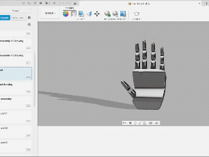
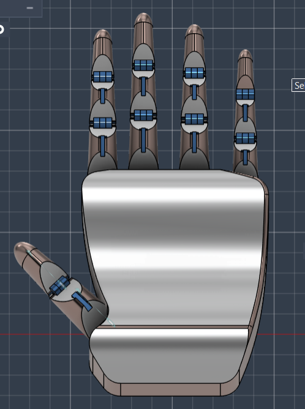
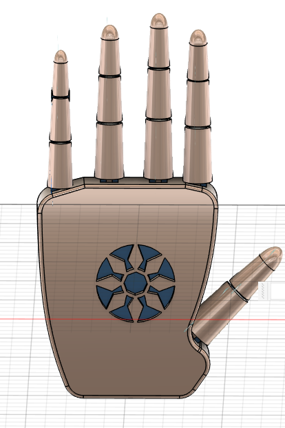
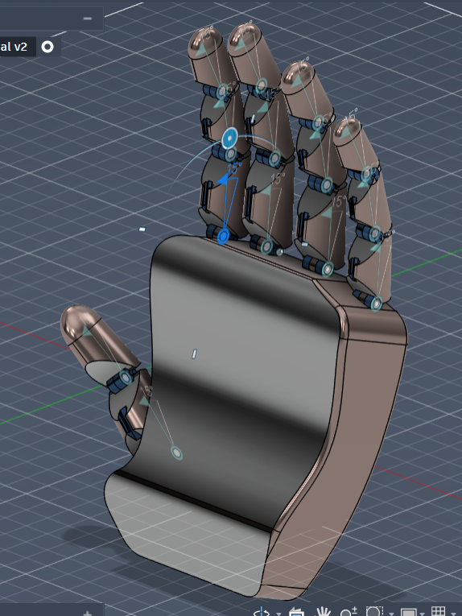
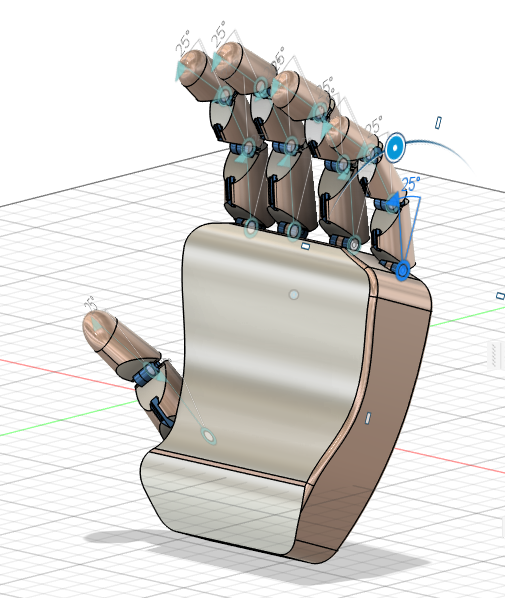

# BIONIC HAND PROJECT
🦾 Bionic Hand — CAD Design Project

> The design of a bionic hand involves replicating the intricate movements of the human hand to create a functional, anthropomorphic robotic model. This project focuses on creating a highly detailed CAD model of a bionic hand in Fusion 360, with attention to each finger's movements, thumb articulation, palm arch, and optional wrist mobility. The final design will aim to closely mimic the natural hand's degrees of freedom, providing flexion, extension, abduction, adduction, and rotational movements at key joints. The design is divided into stages to simplify development, each focusing on different parts of the hand.

---

## 📌 Project Overview

This project is a **first-year robotics learning exercise** focused on CAD modelling a bionic hand in Fusion 360. The goal was to understand mechanical joint design, assembly workflows, and how to approximate human hand geometry.

The hand geometry and proportions are **approximate**, referenced from my own hand measurements and general online research. The model successfully demonstrates flexion and extension across finger joints and serves as a foundation to build upon in later stages.

| Property | Details |
|---|---|
| **Software** | Autodesk Fusion 360 |
| **Status** | ✅ Trying to include more movements· 🔄 Actively Improving |
| **Movements Implemented** | Flexion, Extension |
| **Design Basis** | Approximate — self-measured dimensions + online research |

---

## 🖼️ Preview



## 📸 Views

| Front | Back |
|---|---|
|  |  |

| Isometric 1 | Isometric 2 |
|---|---|
|  |  |

## 🗂️ Repository Structure

```
bionic-hand/
│
├── 📁 cad/                        # Fusion 360 source files (.STEP / .f3z)
│   ├── fingers/                   # Individual finger component files
│   ├── thumb/                     # Thumb assembly files
│   ├── palm/                      # Palm and carpometacarpal joints
│   └── assembly/                  # Full hand assembly
│
├── 📁 assets/
│   ├── renders/                   # (.stl files) and Screenshots and rendered images
│   └── diagrams/                  # Joint diagrams
│
├── 📁 docs/
│   ├── research.md                # Research notes and references
│   ├── challenges.md              # Problems encountered & solutions
│   └── dimensions.md              # Hand measurement data used
│
├── README.md                      # You are here
└── ROADMAP.md                     # Future development stages
```

---

## ⚠️ Scope & Limitations

This is a **student learning project**, not a professional engineering model. Some important caveats:

- Finger and palm geometry are **approximations**, not precision anatomical replicas
- Dimensions were measured roughly from my own hand — no digital caliper or medical reference was used
- Joint mechanisms are simplified; real prosthetic hands involve significantly more complex geometry
- The model has not been validated for 3D printing or physical fabrication

The primary value of this project is the **learning process**: understanding Fusion 360 workflows, joint mechanics, and the fundamentals of mechanical design in robotics.

---


### ✅ Stage 1 — Finger Design
- Modelled all four fingers (index, middle, ring, pinky)
- Implemented **flexion and extension** at:
  - Metacarpophalangeal (MCP) joint
  - Proximal Interphalangeal (PIP) joint
  - Distal Interphalangeal (DIP) joint
- Dimensions based on self-measured hand proportions
- Joint mechanisms designed for smooth, realistic motion

### 🔜 Stage 2 — Thumb Design
- Full flexion/extension and abduction/adduction at MCP and CMC joints
- Supination/Pronation at the carpometacarpal joint
- Replicating natural thumb rotation for complex grip

### 🔜 Stage 3 — Carpometacarpal (CMC) Joints (4th & 5th Fingers)
- Flexion/extension at CMC joints to form the **palm arch**
- Essential for realistic grip curvature

### 🔜 Final Stage — Full Assembly & Integration
- Assemble all components into a unified bionic hand
- Validate joint articulation across all degrees of freedom

### 🔜 Bonus — Wrist Movements
- Flexion/Extension
- Radial/Ulnar Deviation
- Optional: Pronation/Supination

---

## ⚙️ Technical Details

### Joint Architecture
Each finger contains **3 independently articulated joints**:

```
Finger
 └── MCP (Metacarpophalangeal)     — knuckle joint
      └── PIP (Proximal IP)        — middle joint
           └── DIP (Distal IP)     — fingertip joint
```

### Degrees of Freedom (Planned)
| Joint | Movements | DoF |
|---|---|---|
| MCP (fingers) | Flex/Ext + Abd/Add | 2 |
| PIP | Flex/Ext | 1 |
| DIP | Flex/Ext | 1 |
| Thumb CMC | Flex/Ext + Abd/Add + Rot | 3 |
| Thumb MCP | Flex/Ext | 1 |
| CMC (4th/5th) | Flex/Ext | 1 each |
| Wrist | Flex/Ext + Radial/Ulnar | 2 |

---

## 🧩 Challenges & Solutions

### 1. Joint Dimension Accuracy
**Problem:** Translating real hand measurements into precise CAD geometry was non-trivial. Minor inaccuracies in joint radii caused problems in the modelled joints.  
**Solution:** Iterated on joint dimensions using measured phalanx lengths and widths from my own hand, cross-referenced with published anatomical proportion ratios.

### 2. Movement Constraints in Fusion 360
**Problem:** Setting up accurate joint limits for flexion/extension in Fusion 360's joint system required careful understanding of the `As-Built Joint` vs `Joint` workflow, and motion limits were initially misconfigured.  
**Solution:** Studied Fusion 360's joint documentation and community resources.

### 3. Assembly Alignment Issues
**Problem:** When assembling multiple finger components, misaligned joint origins caused unexpected rotations and component clashing.  
**Solution:** Established a consistent joint origin convention across all finger components before assembly. Used `Align` and `Capture Position` tools to correct misalignments systematically.

### 4. Reference Data for Human Hand Proportions
**Problem:** Publicly available hand dimension data varies significantly between sources, making it difficult to determine reliable baseline measurements.  
**Solution:** Took direct measurements from my own hand (phalanx lengths, joint widths, palm dimensions) as the primary reference. Supplemented with academic anthropometric studies to validate proportions.

---

## 📚 Research & References

### Academic / Technical Sources
- Anthropometric studies on human hand dimensions and joint ranges of motion
- Biomechanics literature on finger joint degrees of freedom
- Research on existing bionic/prosthetic hand designs (Academic papers on google.)

### Video Resources
- Fusion 360 joint and assembly tutorials (YouTube)
- Mechanical design for robotics — linkage and joint mechanism tutorials

### Primary Reference
- **Self-measured hand dimensions** — phalanx lengths, joint widths, palm geometry

> 📄 Full references and notes: [`docs/research.md`](docs/research.md)

---

## 🚀 Roadmap

See [`ROADMAP.md`](ROADMAP.md) for the full development plan.

**Short-term:**
- [ ] Complete thumb design with all DoF (Stage 2)
- [ ] Add abduction/adduction to MCP joints
- [ ] Improve joint tolerances for cleaner motion simulation

**Medium-term:**
- [ ] Export STL files for 3D printing viability check

**Long-term:**
- [ ] Wrist joint integration (Bonus Stage)
- [ ] Actuator/tendon routing design
- [ ] Evaluate for physical prototyping (servos + 3D printing)

---

## 🤝 Contributing

This is an ongoing academic/personal robotics project. If you have suggestions on joint mechanisms, CAD techniques, or anatomical accuracy improvements, feel free to open an issue or submit a pull request.

---


